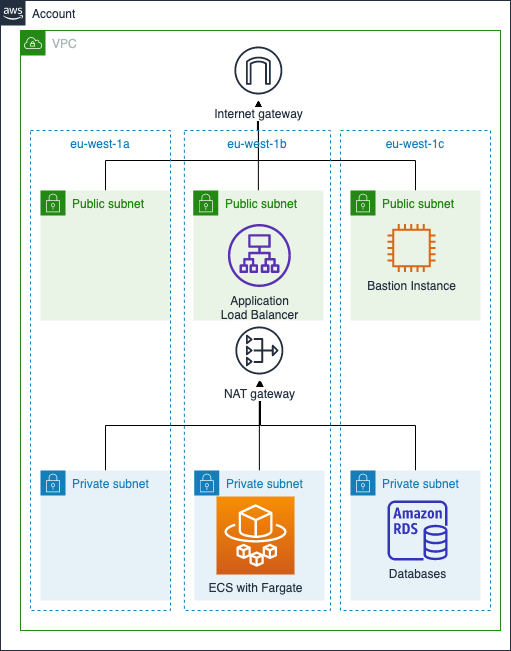

# ecs-demo

This directory contains a demonstration of a Virtual Private Cloud (VPC) created for running applications. For simplicity, only a single web applicationis run, packaged into Docker image and run via the Elatics Container Service (ECS) using the Fargate launch type. Fargate is used to remove the need to provision virtual machines for running Docker containers.

The Fargate runtime is connected to a private subnet (which does not have direct route to public internet). A RDS/PostgreSQL database instance is also attached to the private subnet. Application Load Balancer (ALB) is then deployed to a public subnets, in order to expose the application to the public internet. A bastion host module is also provided for SSH tunneling.

The architecture picture below shows the network structure, along how the services are situated in the subnets.



The module setup is meant to mimic a real life project, so it might be more complex than what is absolutely necessary for a minimal Fargate based web service. To regain simplicity in creating the infrastructure, helper scripts are provided for apply/destroy the whole suite in one go.

## Usage

### 1. Preparation

To bring the resources into life, we first need to create a Terraform backend, which stores the state of each resource. To do this, follow the instructions in the [terraform-backend directory](../terraform-backend) directory.

Also, take a cup of coffee or some snack, creating all the resources, even in one go, takes around 20 minutes :)

### 2. Fast Track: Create All Resources with Helper Script

Alternative to running `terraform apply` in each module separately in [dependency order](https://github.com/metosin/cloud-busting/blob/main/aws/ecs-demo/modules/README.md#module-dependencies), you can create all of the resources in one go, with a bit of preparation:

1. Install the [sops](https://github.com/mozilla/sops) tool via [these instructions](https://github.com/metosin/cloud-busting/blob/main/aws/README.md#sops-installation)
2. Specify the master password for RDS/PostgreSQL instance via [these instructions](https://github.com/metosin/cloud-busting/tree/main/aws/ecs-demo/modules/rds#specifying-master-user-password)
3. Specify your `AWS_PROFILE`, `AWS_DEAFULT_REGION` and Terraform resource `prefix`:
```bash
export AWS_DEFAULT_REGION=eu-west-1
export AWS_PROFILE=<YOUR-VALUE-HERE>
export TF_VAR_prefix=<YOUR-VALUE-HERE>
```
4. Run the `apply-all.sh` script
```bash
./apply-all.sh
```

Sit back and watch the fireworks 🎆 :) 

### 3. Study Resources in AWS Console

While resources are being created, sign into the AWS Console and study for example the [VPC](https://eu-west-1.console.aws.amazon.com/vpc/home?region=eu-west-1#vpcs:) (Virtual Private Cloud), [RDS](https://eu-west-1.console.aws.amazon.com/rds/home?region=eu-west-1#databases:) (Relational Database Service), [ECS](https://eu-west-1.console.aws.amazon.com/ecs/home?region=eu-west-1#/clusters) (Elastic Container Service) Consoles. When all the resources are created, the [Resource Groups](https://eu-west-1.console.aws.amazon.com/resource-groups/home?region=eu-west-1#) Console will provide a place to navigate to all the resources. 

### 4. In depth: Create Resources Individually

The resources of each module can be created by running the following commands inside the module directory:

* `source ../../../tools/terraform-init`
* `terraform plan`
* `terraform apply`

NOTE: We replace `terraform init` with our script here (`source ../../../tools/terraform-init`) - the script populates the correct values for the Terraform state S3 bucket, lock DynamoDB table and the KMS encrytion key that you used when initializing the backend earlier.

The modules depend on each other via [Terrafrom remote state](https://www.terraform.io/docs/providers/terraform/d/remote_state.html), so the [Terraform apply](https://www.terraform.io/docs/commands/apply.html) commands needs to be run in the module [dependency order](https://github.com/metosin/cloud-busting/blob/main/aws/ecs-demo/modules/README.md#module-dependencies).

### Last Step: Destroy

When the resources are no longer needed, they can be destroyed via `terraform destroy` command.

Either run `terraform destroy` individually in all modules in dependency order, or run the `destroy-all.sh` script, which does the required steps in dependency order in one go.
