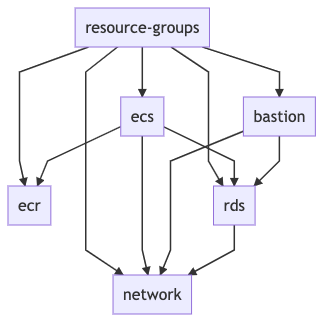

# Webapp modules

This example consists of the following Terraform modules:

* network
  * A VPC within which the backend and database are to be run
* ecs
  * Resources for running the webapp container and providing a load balancer endpoint to the application
* rds
  * A PostgreSQL database module
* bastion
  * A bastion host for SSH tunneling
* ecr
  * A module for the Docker repository
* resource-groups
  * A module that defines resource groups for making it easier to find the resources from the AWS console
  
## Preparation

First, the Terraform backend resources need to be created, follow instructions in the [terraform-backend directory](../../terraform-backend).

## Apply

Your next step is to open a terminal and `cd` into each of these directories and give the following commands (just as you did previously with the backend):

* `source ../../../tools/terraform-init`
* `terraform plan`
* `terraform apply`

NOTE: We replace `terraform init` with our script here (`source ../../../tools/terraform-init`) - the script populates the correct values for the Terraform state S3 bucket, lock DynamoDB table and the KMS encrytion key that you used when initializing the backend earlier.

The modules depend on each other via [Terrafrom remote state](https://www.terraform.io/docs/providers/terraform/d/remote_state.html), so the [Terraform apply](https://www.terraform.io/docs/commands/apply.html) commands needs to be run in the module dependency order:

```
network
ecr
rds
ecs
bastion
resource-groups
```

Here's also picture of the module dependency graph:



## Fast Track for Apply and Destroy

### Apply

Alternative to running `terraform apply` in each module separately in dependency order, you can create all of the resources in one go, with a bit of preparation:

1. Install the [sops](https://github.com/mozilla/sops) tool via [these instructions](https://github.com/metosin/cloud-busting/blob/main/aws/README.md#sops-installation)
2. Specify the master password for RDS/PostgreSQL instance via [these instructions](https://github.com/metosin/cloud-busting/tree/main/aws/ecs-demo/modules/rds#specifying-master-user-password)
3. Specify your `AWS_PROFILE`, `AWS_DEAFULT_REGION` and Terraform resource `prefix`:
```bash
export AWS_DEFAULT_REGION=eu-west-1
export AWS_PROFILE=<YOUR-VALUE-HERE>
export TF_VAR_prefix=<YOUR-VALUE-HERE>
```
4. Run the `apply-all.sh` script
```bash
./apply-all.sh
```

Sit back and watch the fireworks 🎆 :) 

### Destroy

Also, alternative to running `terraform destroy` in each module separately in dependency order, the `destroy-all.sh` script can be used to destroy all modules in one go.
